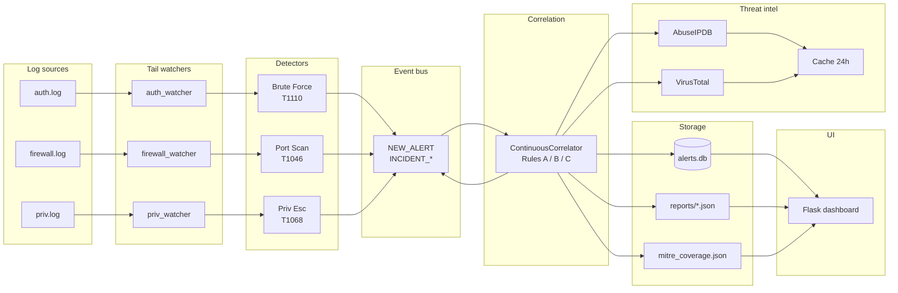

# SOCshield — System Architecture

This document explains every component in the SOCshield pipeline, in
the order data flows through it. Mermaid source for each diagram is in
[`docs/diagrams/`](diagrams/) so you can edit and re-render them on
GitHub without external tooling.

## Top-level view



## 1. Log sources

Three flat-file logs are tailed at runtime. They live in `logs/` by
default and can be relocated via env (`SOCSHIELD_AUTH_LOG`,
`SOCSHIELD_FIREWALL_LOG`, `SOCSHIELD_PRIV_LOG`).

| File            | Format                                                | Source          |
| --------------- | ----------------------------------------------------- | --------------- |
| `auth.log`      | `2026-06-17 08:17:02 WARN sshd Failed login user=… ip=…` | SSH / auth logs |
| `firewall.log`  | `2026-06-17 08:15:10 INFO kernel DROP … src=… dst=… dport=… proto=…` | Netfilter / pfsense / iptables |
| `priv.log`      | `2026-06-17 08:30:01 WARN sudo … user=… target=root …` | sudo / auditd   |

The line format is the one SOCshield parses natively; new log sources
are plug-in additions (see [ROADMAP.md](../ROADMAP.md)).

## 2. Tail watchers

`app/watchers/base.py` defines `TailWatcher`, a `threading.Thread`
subclass that:

1. Stats the file every poll interval (1 s by default).
2. On the first tick, seeks to current EOF so it never replays history.
3. Detects rotation (file shrank beneath the saved offset) and resets.
4. Reads new bytes, splits on `\n`, hands complete lines to the
   detector.

Each watcher is a thin adapter that delegates parsing to its detector:

| Watcher            | File                | Module                  |
| ------------------ | ------------------- | ----------------------- |
| `auth_watcher`     | `auth.log`          | `detectors.brute_force_detector` |
| `firewall_watcher` | `firewall.log`      | `detectors.port_scan_detector`   |
| `priv_watcher`     | `priv.log`          | `detectors.priv_esc_detector`    |

## 3. Detectors

All three detectors return a list of `Alert` objects
([`app/models.py`](../app/models.py)) — the project's single, shared
alert model. The dataclass fields are the columns of the `alerts` SQL
table plus the MITRE fields:

```
Alert(
    timestamp: datetime,
    source_ip: str,
    detector:  str,        # BRUTE_FORCE | PORT_SCAN:* | PRIV_ESC
    severity:  str,        # LOW | MEDIUM | HIGH | CRITICAL
    title:     str,
    description: str,
    mitre_technique: str,  # T1110 | T1046 | T1068
    mitre_tactic:    str,  # Credential Access | Reconnaissance | …
)
```

### Brute force

Sliding 60-second window over failed-login lines. ≥ 3 attempts from
one IP inside any rolling window raises a `BRUTE_FORCE` alert. The
window is expanded as new attempts arrive, so the same source IP can
produce a series of escalating alerts (3 → 4 → 5 → …). Severity scales
with attempt count (≥ 3 → MEDIUM, ≥ 5 → HIGH, ≥ 8 → CRITICAL).

### Port scan

The detector inspects every firewall event and runs three classifiers
in order:

- **Horizontal** — one source IP → multiple destination ports on the
  same destination host. Threshold: 5 distinct ports.
- **Vertical** — one source IP → multiple destination hosts on the
  same destination port. Threshold: 5 distinct hosts.
- **SYN flood** — one source IP → ≥ 20 SYN packets inside 60 s.

All three produce a `PORT_SCAN:*` alert with the same `T1046`
technique. The "kind" is preserved in the `detector` column so the
dashboard can show "Horizontal / Vertical / SYN Flood" instead of an
opaque bucket.

### Privilege escalation

Parses the priv log for suid set, sudoers modification, capability
acquisition, and root shell acquisition. Each match raises a
`PRIV_ESC` alert at `CRITICAL`.

## 4. Event bus

A synchronous pub/sub bus
([`app/event_bus.py`](../app/event_bus.py)) with per-subscriber
dispatcher threads. Three topics are published:

| Topic                | Payload                                           | Subscribers                    |
| -------------------- | ------------------------------------------------- | ------------------------------ |
| `NEW_ALERT`          | `Alert` instance (or `{"alert": Alert}` envelope) | Continuous correlator, DB persister |
| `INCIDENT_CREATED`   | `Campaign.to_dict()`                              | Incident-event logger, metrics |
| `INCIDENT_UPDATED`   | `Campaign.to_dict()`                              | Incident-event logger, metrics |

The bus is non-blocking: subscribers have a bounded queue (10 000
events). On overflow the event is dropped and a log line is written.
This protects the pipeline from a runaway detector.

## 5. Correlation engine

`app/correlator.py` implements three rules over the alerts grouped by
`source_ip`:

| Rule | Condition                                                     | Risk    | Name                              |
| ---- | ------------------------------------------------------------- | ------- | --------------------------------- |
| A    | `PORT_SCAN:*` + `BRUTE_FORCE` from same IP                    | HIGH    | Reconnaissance + Credential Attack |
| B    | `PORT_SCAN:*` + `BRUTE_FORCE` + `PRIV_ESC` from same IP       | CRITICAL| Full Intrusion Chain              |
| C    | ≥ 2 `PRIV_ESC` events at `CRITICAL` from same IP              | CRITICAL| Insider Threat Candidate          |

Each rule produces a `Campaign` object:

```
Campaign(
    source_ip, rule_id, rule_name, risk,
    matched_detectors, alerts, timeline, narrative, summary,
    threat_intel, mitre_techniques, mitre_tactics, attack_path,
)
```

The `ContinuousCorrelator` runs in a background thread, re-correlates
on every new alert, and emits `INCIDENT_CREATED` for new campaigns
and `INCIDENT_UPDATED` when an existing campaign's risk changes.

## 6. Threat intelligence enrichment

`threat_intel/enrichment.py` walks every campaign, looks up the
source IP through:

1. **Local cache** (`threat_intel/cache.db`, 24 h TTL) — return
   immediately if fresh.
2. **AbuseIPDB** — abuse confidence score, reports, country, ISP.
3. **VirusTotal** — reputation, malicious / suspicious counts.
4. **Cache write** — store the merged result.

A single `ThreatIntel` dataclass normalises both providers:

```
ThreatIntel(
    ip, abuse_score, abuse_reports, country, isp, reputation,
    malicious_count, suspicious_count, malicious, sources,
    fetched_at, errors,
)
```

If neither API key is set, the entrypoint auto-enables mock mode
(`SOCSHIELD_MOCK_TI=1`) and the providers return synthetic data so the
rest of the pipeline is exercised end-to-end.

## 7. Storage

Three pieces of durable state:

| Path                           | Format           | Writer                            | Reader                              |
| ------------------------------ | ---------------- | --------------------------------- | ----------------------------------- |
| `database/alerts.db`           | SQLite (alerts)  | `_wire_db_persister`              | Dashboard, coverage report          |
| `threat_intel/cache.db`        | SQLite (ip, json)| `threat_intel.cache.put`          | `threat_intel.cache.get`            |
| `reports/incidents/*.json`     | JSON             | `reports.report_generator`        | Dashboard                           |
| `reports/mitre_coverage.json`  | JSON             | `reports.coverage_report`         | Dashboard, `docs/mitre_coverage.md` |

All four can be relocated via env (`SOCSHIELD_DB_PATH`,
`SOCSHIELD_TI_CACHE_PATH`, `SOCSHIELD_REPORTS_DIR`) and Docker
volumes.

## 8. Dashboard

`app/web/` is a Flask app served on `:5000`. It does **not** write
to any of the stores — it's a pure read-only consumer. The layout:

- `queries.py` — read-only data access (parameterised SQL)
- `routes.py` — web + API blueprints
- `templates/` — Jinja2 templates (base, dashboard, alerts, …)
- `static/css/socshield.css` — dark SOC theme, slate/amber palette
- `static/js/socshield.js` — Chart.js + 30 s polling

The auto-refresh polls `/api/summary` and `/api/alerts/recent` every
30 s and updates the KPI block + the "recent alerts" table in place.

## 9. Supervisor (production)

Inside the Docker container, `app/supervisor.py` runs:

- The monitoring service in a **background thread** (watchers + bus +
  correlator + DB persister)
- The Flask dashboard in the **foreground** (PID 1)

A single `docker stop` sends SIGTERM to one process, which the
supervisor forwards to both halves for graceful shutdown. Tini is the
PID 1 wrapper to ensure signal forwarding works correctly.

## 10. What does NOT change between batch and service mode

The detection, correlation, and threat-intel layers are identical
between the two modes. The batch pipeline (`python main.py`) runs
detectors over a snapshot of the logs; the service mode runs the same
detectors over a live tail. Both feed the same correlator. Both write
to the same SQLite DB and the same reports directory.
