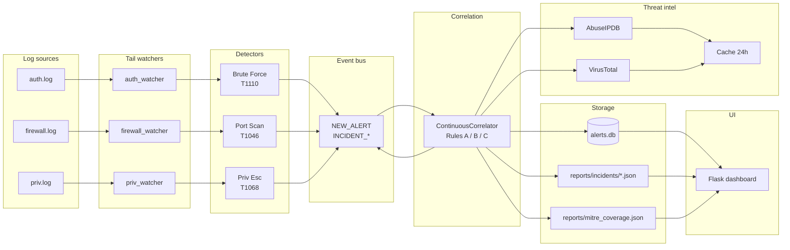

# Diagram 01 — System Architecture

The full data flow, end-to-end, from log files to dashboard. Renders
on GitHub automatically (the `mermaid` fenced block below is parsed by
GitHub's Mermaid renderer).

