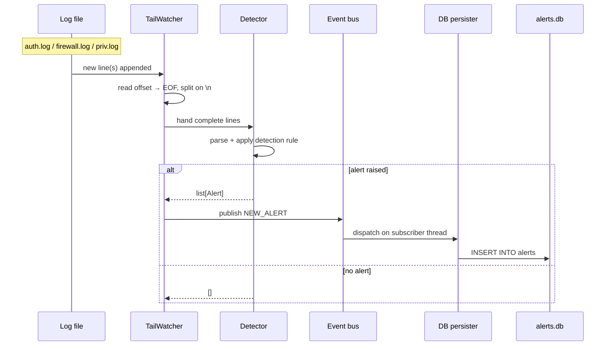

# Diagram 02 — Alert Pipeline

What happens between "a log line is written" and "an alert row appears
in SQLite."

```mermaid
sequenceDiagram
  participant FS as Log file
  participant W as TailWatcher
  participant Det as Detector
  participant Bus as Event bus
  participant Persist as DB persister
  participant DB as alerts.db

  Note over FS: auth.log / firewall.log / priv.log
  FS->>W: new line(s) appended
  W->>W: read offset → EOF, split on \n
  W->>Det: hand complete lines
  Det->>Det: parse + apply detection rule
  alt alert raised
    Det-->>W: list[Alert]
    W->>Bus: publish NEW_ALERT
    Bus->>Persist: dispatch on subscriber thread
    Persist->>DB: INSERT INTO alerts
  else no alert
    Det-->>W: []
  end
```
