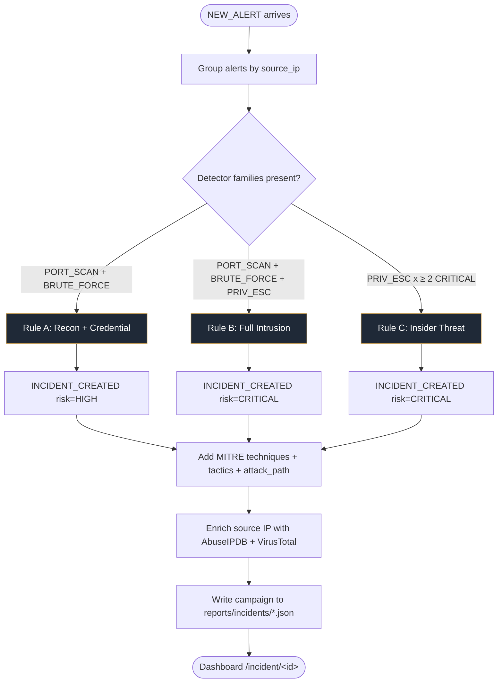

# Diagram 03 — Correlation Workflow

How the three rules A, B, C fire on a stream of alerts.

```mermaid
flowchart TB
  Start([NEW_ALERT arrives]) --> Group[Group alerts by source_ip]
  Group --> CheckFamilies{Detector families present?}

  CheckFamilies -->|PORT_SCAN + BRUTE_FORCE| RuleA[Rule A: Recon + Credential]
  CheckFamilies -->|PORT_SCAN + BRUTE_FORCE + PRIV_ESC| RuleB[Rule B: Full Intrusion]
  CheckFamilies -->|PRIV_ESC x ≥ 2 CRITICAL| RuleC[Rule C: Insider Threat]

  RuleA --> EmitA[INCIDENT_CREATED risk=HIGH]
  RuleB --> EmitB[INCIDENT_CREATED risk=CRITICAL]
  RuleC --> EmitC[INCIDENT_CREATED risk=CRITICAL]

  EmitA --> MITRE[Add MITRE techniques + tactics + attack_path]
  EmitB --> MITRE
  EmitC --> MITRE

  MITRE --> TI[Enrich source IP with AbuseIPDB + VirusTotal]
  TI --> Persist[Write campaign to reports/incidents/*.json]
  Persist --> Done([Dashboard /incident/&lt;id&gt;])

  classDef rule fill:#1f2937,stroke:#d4a85a,color:#fff
  class RuleA,RuleB,RuleC rule
```
