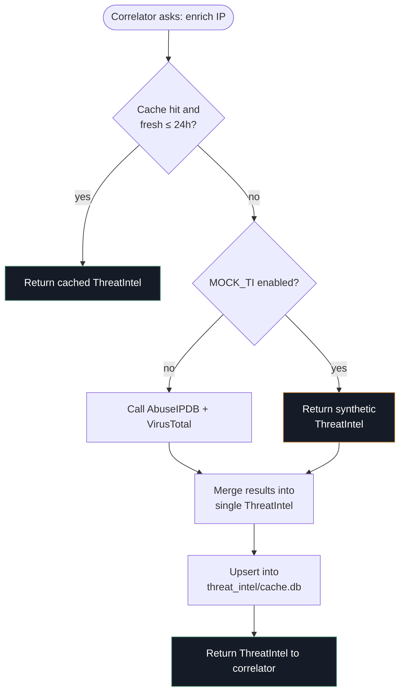

# Diagram 04 — Threat Intelligence Flow

Cache → provider → cache, with graceful degradation to mock mode.

```mermaid
flowchart TB
  Start([Correlator asks: enrich IP]) --> Cache{Cache hit and<br/>fresh ≤ 24h?}

  Cache -- yes --> Return1[Return cached ThreatIntel]
  Cache -- no --> Mock{MOCK_TI enabled?}

  Mock -- yes --> Synthetic[Return synthetic<br/>ThreatIntel]
  Mock -- no --> Providers[Call AbuseIPDB + VirusTotal]

  Providers --> Merge[Merge results into<br/>single ThreatIntel]
  Synthetic --> Merge

  Merge --> Persist[Upsert into<br/>threat_intel/cache.db]
  Persist --> Return2[Return ThreatIntel to correlator]

  classDef ok fill:#161c27,stroke:#5fa882,color:#fff
  classDef warn fill:#161c27,stroke:#d68a3a,color:#fff
  class Return1,Return2 ok
  class Synthetic warn
```
