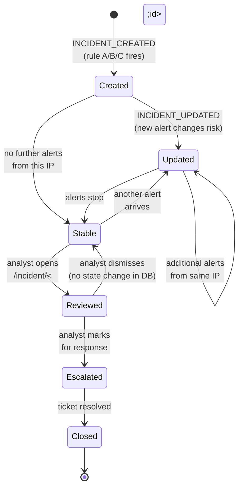

# Diagram 05 — Incident Lifecycle

An incident's journey from "first alert" to "dismissed or escalated."

```mermaid
stateDiagram-v2
  [*] --> Created : INCIDENT_CREATED<br/>(rule A/B/C fires)

  Created --> Updated : INCIDENT_UPDATED<br/>(new alert changes risk)
  Created --> Stable : no further alerts<br/>from this IP

  Updated --> Updated : additional alerts<br/>from same IP
  Updated --> Stable : alerts stop

  Stable --> Reviewed : analyst opens<br/>/incident/&lt;id&gt;
  Stable --> Updated : another alert<br/>arrives

  Reviewed --> Stable : analyst dismisses<br/>(no state change in DB)
  Reviewed --> Escalated : analyst marks<br/>for response

  Escalated --> Closed : ticket resolved
  Closed --> [*]
```
